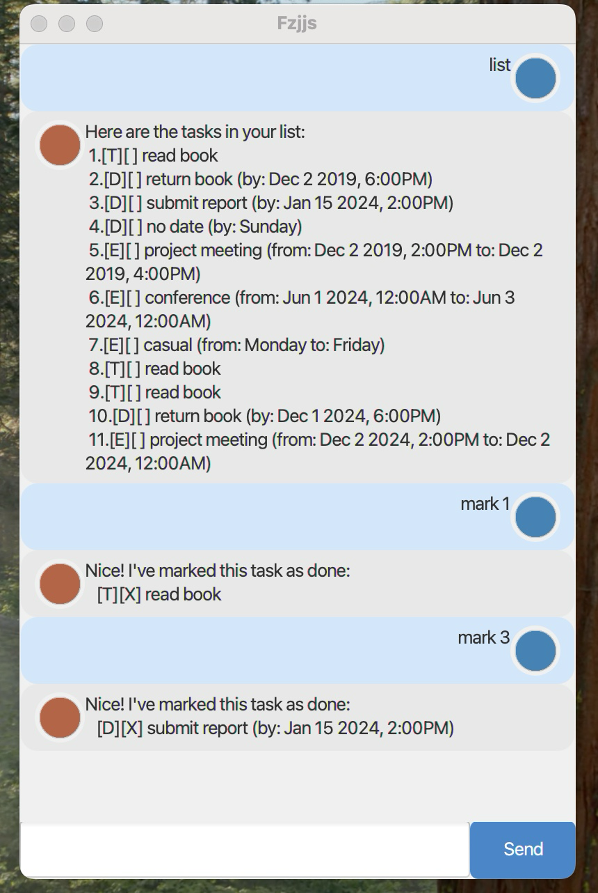

# Fzjjs User Guide

Fzjjs is a task management chatbot that helps you keep track of your todos, deadlines, and events via a simple chat interface.



## Quick Start

1. Ensure you have Java 17 or later installed.
2. Download the latest `duke.jar` from the [Releases](https://github.com/ZhangQixiang123/ip/releases) page.
3. Copy the JAR to an empty folder.
4. Open a terminal, navigate to the folder, and run: `java -jar duke.jar`

## Features

### Adding a todo: `todo`

Adds a task without any date.

Format: `todo DESCRIPTION`

Example: `todo read book`

```
Got it. I've added this task:
   [T][ ] read book
 Now you have 1 tasks in the list.
```

### Adding a deadline: `deadline`

Adds a task with a due date.

Format: `deadline DESCRIPTION /by DATE`

Date formats accepted: `yyyy-MM-dd`, `d/M/yyyy`, `yyyy-MM-dd HHmm`, `d/M/yyyy HHmm`

Example: `deadline return book /by 2024-01-15 1800`

```
Got it. I've added this task:
   [D][ ] return book (by: Jan 15 2024, 6:00PM)
 Now you have 2 tasks in the list.
```

### Adding an event: `event`

Adds a task that spans a time period.

Format: `event DESCRIPTION /from START /to END`

Example: `event project meeting /from 2024-01-15 1400 /to 2024-01-15 1600`

```
Got it. I've added this task:
   [E][ ] project meeting (from: Jan 15 2024, 2:00PM to: Jan 15 2024, 4:00PM)
 Now you have 3 tasks in the list.
```

### Listing all tasks: `list`

Shows all tasks in your list.

Format: `list`

```
Here are the tasks in your list:
 1.[T][ ] read book
 2.[D][ ] return book (by: Jan 15 2024, 6:00PM)
 3.[E][ ] project meeting (from: Jan 15 2024, 2:00PM to: Jan 15 2024, 4:00PM)
```

### Marking a task as done: `mark`

Marks the specified task as completed.

Format: `mark INDEX`

Example: `mark 1`

```
Nice! I've marked this task as done:
   [T][X] read book
```

### Unmarking a task: `unmark`

Marks the specified task as not done.

Format: `unmark INDEX`

Example: `unmark 1`

```
OK, I've marked this task as not done yet:
   [T][ ] read book
```

### Deleting a task: `delete`

Removes the specified task from the list.

Format: `delete INDEX`

Example: `delete 1`

```
Noted. I've removed this task:
   [T][ ] read book
 Now you have 2 tasks in the list.
```

### Finding tasks: `find`

Searches for tasks whose descriptions contain the given keyword.

Format: `find KEYWORD`

Example: `find book`

```
Here are the matching tasks in your list:
 1.[T][ ] read book
 2.[D][ ] return book (by: Jan 15 2024, 6:00PM)
```

### Exiting the program: `bye`

Exits the chatbot.

Format: `bye`

## Data Storage

Tasks are automatically saved to `data/duke.txt` in the same directory as the JAR file. The file is created automatically if it does not exist.

## Command Summary

| Command | Format |
|---------|--------|
| todo | `todo DESCRIPTION` |
| deadline | `deadline DESCRIPTION /by DATE` |
| event | `event DESCRIPTION /from START /to END` |
| list | `list` |
| mark | `mark INDEX` |
| unmark | `unmark INDEX` |
| delete | `delete INDEX` |
| find | `find KEYWORD` |
| bye | `bye` |
